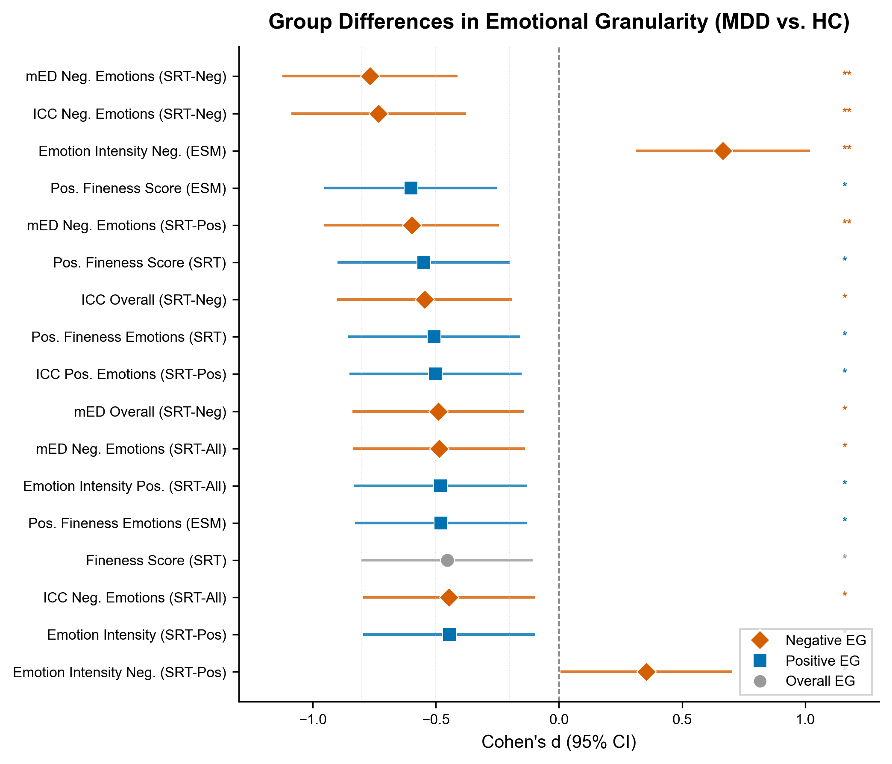
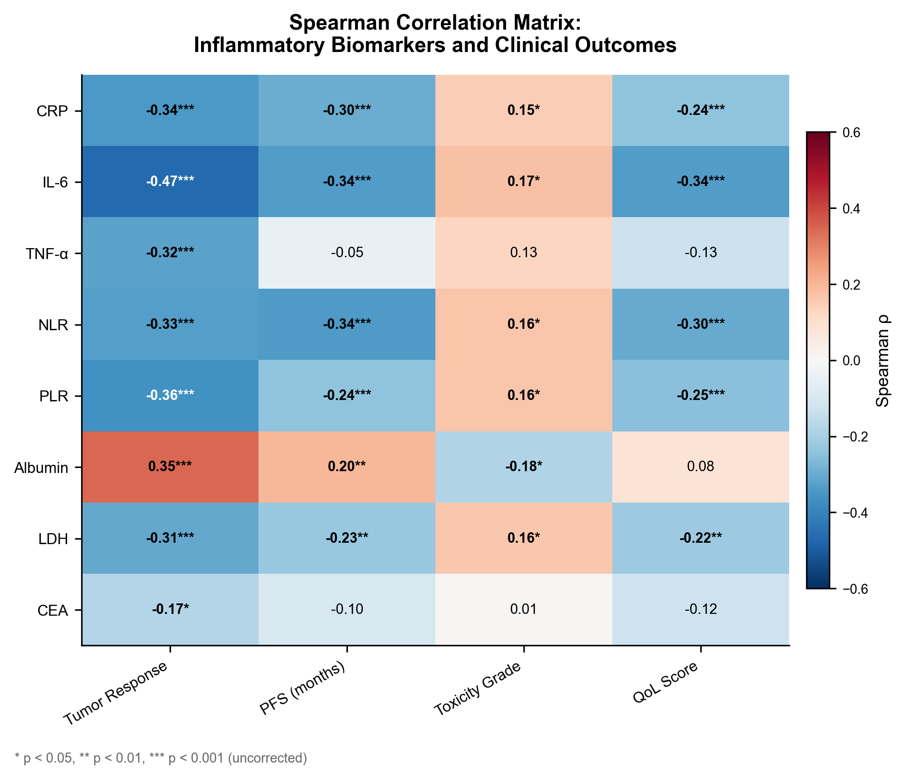
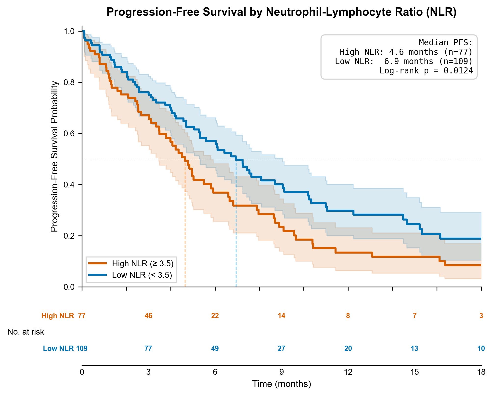
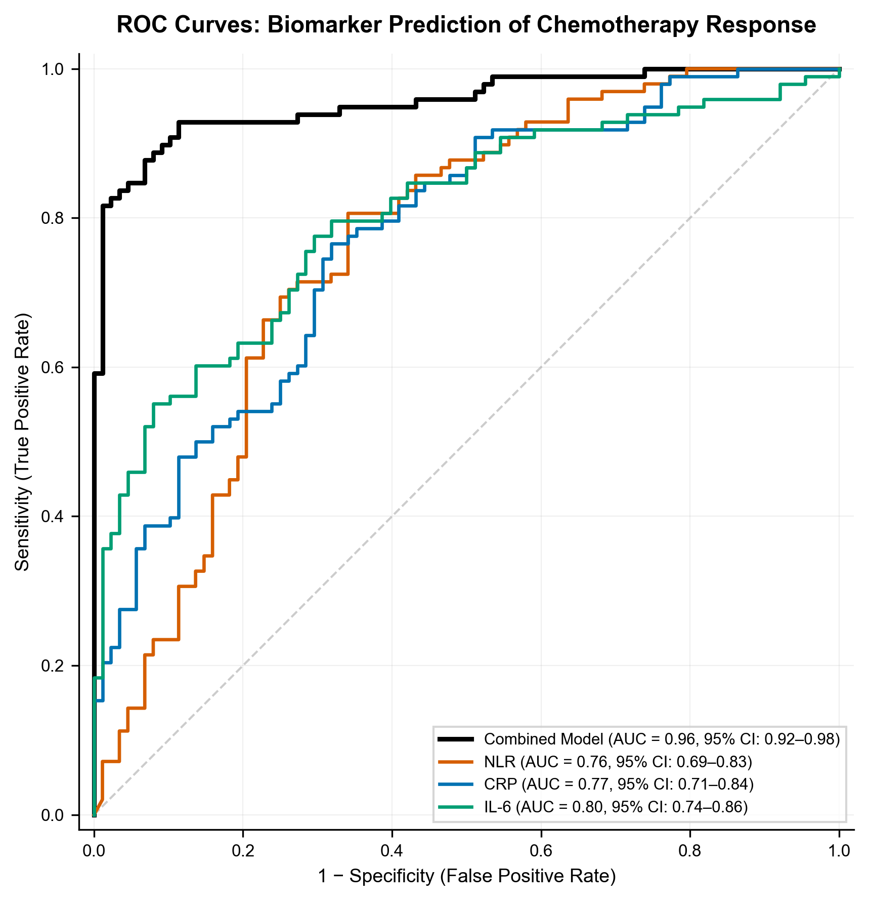

# AI 科研军团 ⚔️🔬

> 让 Claude Code 变成你的医学科研团队。8 位 AI 专家协作，从数据到投稿级论文，全程自主执行。

中文 | [English](README_EN.md)

---

## 特点

- **医学科研专精** — 针对临床研究优化（STROBE/CONSORT 合规、P-hacking 防护）
- **8 位 AI 专家协作** — 不是一个 AI 切换角色，而是 8 位各有灵魂和专长的虚拟研究员
- **全程自主执行** — 一句话启动，自动跑完 9 个阶段，断点可续
- **质量闭环** — 8 层审查 + 最多 3 轮自动迭代，直到达标
- **不挑模型** — Claude Opus/Sonnet/Haiku 都能跑，只是质量不同
- **纯 Markdown** — 零依赖，零锁定，每个 skill 就是一个 `SKILL.md`

---

## 真实效果

以下图表由 AI 科研军团自主生成（基于模拟的 NSCLC 化疗反应数据集，N=186），展示全流程产出质量：

### 生物标志物组间效应量森林图

12 个炎症/营养标志物在化疗应答者 vs 非应答者间的差异，按效应量排序，FDR 校正：



### 标志物-结局相关性热图

8 个生物标志物 × 4 个临床结局的 Spearman 相关矩阵：



### Kaplan-Meier 生存曲线

高 NLR vs 低 NLR 的无进展生存期对比（含风险表和 Log-rank 检验）：



### ROC 预测效能曲线

单标志物及联合模型对化疗应答的预测效能（AUC 0.76-0.96）：



### 完整交付物清单

一次 `/start-army` 全流程运行产出：

| 交付物 | 说明 |
|--------|------|
| `requirement_v1.md` | 结构化需求确认书 |
| `data_dictionary.md` | 完整变量字典 |
| `data_profile_report.md` | 数据画像（分布、缺失、异常值） |
| `research_plan.md` | 研究设计 + 假设 + 统计方案 |
| `analysis_results.md` | 5 项分析完整结果 |
| `results/*.csv` | 7 张统计结果表（可复现） |
| `figures/*.png/.tiff` | 6 张出版级图表（300 DPI） |
| `verified_ref_pool.md` | 文献池（含验证状态标记） |
| `manuscript.md` | ~6000 词 IMRAD 投稿级初稿 |
| `quality_report.md` | 8 层审查报告（含迭代记录） |
| `REVIEW_STATE.json` | 审查状态（支持断点恢复） |

> 从 Excel 原始数据到投稿级论文的**全自动**产出，质量审查经 2 轮迭代从 67 分（C 级）提升至 79 分（B 级）通过。

---

## 快速开始

### 1. 克隆仓库

```bash
git clone https://github.com/TerryFYL/ai-research-army.git
cd ai-research-army
```

### 2. 安装 Skills

```bash
bash install.sh
```

将所有 skill 和 agent 定义复制到 `~/.claude/skills/` 和 `~/.claude/agents/`。

### 3. 启动科研

打开 Claude Code，输入：

```
/start-army "探究 NHANES 2017-2020 数据中久坐行为与心血管疾病风险的关联"
```

然后等着收投稿包就行了。

> **前置条件**: 已安装 [Claude Code](https://docs.anthropic.com/en/docs/claude-code)（`npm install -g @anthropic-ai/claude-code`）

---

## 模型推荐

| 角色 | 推荐模型 | 最低要求 | 说明 |
|------|---------|---------|------|
| 主力执行 | Claude Opus | Claude Sonnet | Opus 推理更深，Sonnet 更快 |
| 统计分析 | Claude Opus | Claude Sonnet | 统计推理需要强逻辑能力 |
| 质量审查（可选） | GPT-5.x / Codex | 同一模型自审 | 跨模型审稿效果更好，但非必须 |
| 文献检索 | 任意 | 任意 | 主要依赖 WebSearch |
| 图表生成 | 任意 | 任意 | 主要依赖代码执行 |

> **预算建议**: 单模型方案完全可行。预算允许的话，加一个审稿模型效果更佳。

---

## 工作流

9 阶段流水线，每阶段由对应专家 Agent 执行：

```
/start-army "研究需求"
       |
       v
 +-----------+     +-----------+     +----------------+     +----------------+
 | 需求结晶   | --> | 数据探查   | --> | 研究设计        | --> | 统计分析        |
 | (Priya)   |     | (Ming)    |     | (Priya+Kenji)  |     | (Kenji)        |
 +-----------+     +-----------+     +----------------+     +----------------+
                                                                    |
       +------------------------------------------------------------+
       v
 +-----------+     +-----------+     +-----------+     +----------------+
 | 学术图表   | --> | 文献调研   | --> | 论文撰写   | --> | 引用验证        |
 | (Lena)    |     | (Jing)    |     | (Hao)     |     | (Jing)         |
 +-----------+     +-----------+     +-----------+     +----------------+
                                                               |
                                                               v
                                                       +----------------+
                                                       | 质量审查        |
                                                       | (Alex, 3轮)    |
                                                       +----------------+
                                                               |
                                                               v
                                                          [ 交付 ]
```

**两个门控节点**:
- **引用验证**: 基础 PubMed 验证（🚧 完整版多源交叉验证开发中）
- **质量审查**: 8 层检查，最多 3 轮，不达标不交付

---

## 团队

| 成员 | 角色 | 核心能力 |
|------|------|---------|
| **Wei** | 团队领航者 | 项目编排、风险直觉、成本控制 |
| **Priya** | 需求翻译官 | 需求结晶、研究设计、叙事线播种 |
| **Ming** | 数据工程师 | 数据清洗、变量标准化、数据画像 |
| **Kenji** | 生物统计师 | 假设检验、效应量解读、P-hacking 防护 |
| **Hao** | 学术写手 | IMRAD 撰写、叙事弧、读者心智建模 |
| **Lena** | 可视化设计师 | 出版级图表、数据对账、色盲友好 |
| **Alex** | 审查官 | 8 层审查、数字溯源、学术诚信一票否决 |
| **Jing** | 文献研究员 | PICOS 检索、PRISMA 合规、引用验证 |

> Wei 是总指挥，不写具体内容。

---

## 所有 Skills

| Skill | 命令 | 说明 |
|-------|------|------|
| 全流程 | `/start-army "需求"` | 一键全程 |
| 数据探查 | `/data-profiler` | 数据画像 + 字典 |
| 研究设计 | `/research-design` | 方案 + 叙事线 + STROBE/CONSORT |
| 统计分析 | `/stat-analysis` | 假设驱动 + 多路径 |
| 学术图表 | `/academic-figure` | 出版级 + 对账 + 色盲友好 |
| 文献管理 | `/ref-manager` | PICOS 检索 + 引用插入 |
| 论文撰写 | `/manuscript-draft` | IMRAD + 叙事驱动 |
| 引用验证 | `/ref-manager verify` | 基础 PubMed 验证（🚧 完整版开发中） |
| 质量审查 | `/quality-review` | 8 层审查 + 自动迭代（最多 3 轮） |
| 投稿包 | `/submit-package` | 期刊可上传材料 |

每个 Skill 都可独立使用：

```
/data-profiler                                    # 只做数据探查
/ref-manager "sedentary behavior cardiovascular"  # 只做文献检索
/academic-figure review                           # 只做图表审查
```

---

## 方法论

> 我们开源理念，不开源具体实现——因为理念可以帮你构建自己的系统。

详见 `methodology/` 目录。

- **先有故事，再有分析** — 叙事脊柱在跑分析之前就设计好，分析服务于故事
- **分析必须串联递进** — 像剥洋葱，每一层答案催生下一层问题
- **标杆解剖先于写稿** — 先解剖 3-5 篇同领域顶刊，提取配方再动手
- **发现必须"可处方"** — 每个发现翻译成医生/政策制定者能直接用的东西
- **质量是设计出来的** — 8 层审查是安全网，真正的质量来自每个阶段做好本职

---

## 自定义

修改 `agents/*.md` 自定义角色。在 `skills/your-skill/SKILL.md` 添加新能力，运行 `bash install.sh`。

适配其他领域只需替换：

| 组件 | 医学默认值 | 修改方向 |
|------|-----------|---------|
| `agents/ming.md` | NHANES/CHARLS | 替换为目标领域数据源 |
| `agents/kenji.md` | 临床统计方法 | 替换为领域常用方法 |
| `quality-review` | STROBE/CONSORT | 替换为领域报告规范 |
| `ref-manager` | PubMed/CNKI | 替换为领域文献数据库 |

---

## FAQ

**可以直接运行吗？** 是的。`bash install.sh` 后 `/start-army` 即可。Agent 为简化版，可按需深度定制。

**需要什么基础？** 命令行 + Claude Code + 基本科研知识（p 值、置信区间）。

**非医学能用吗？** 能，但需改 Agent 和检查清单，详见"自定义"。

---

## 致谢

- [Claude Code](https://docs.anthropic.com/en/docs/claude-code) — 底层执行引擎
- [NHANES](https://www.cdc.gov/nchs/nhanes/index.htm) — 常用数据源

## 贡献

欢迎 PR！特别欢迎新领域 Agent 定义、质量检查清单、方法论补充。

## License

[Apache-2.0](LICENSE) · Copyright 2026 AI Research Army Contributors
