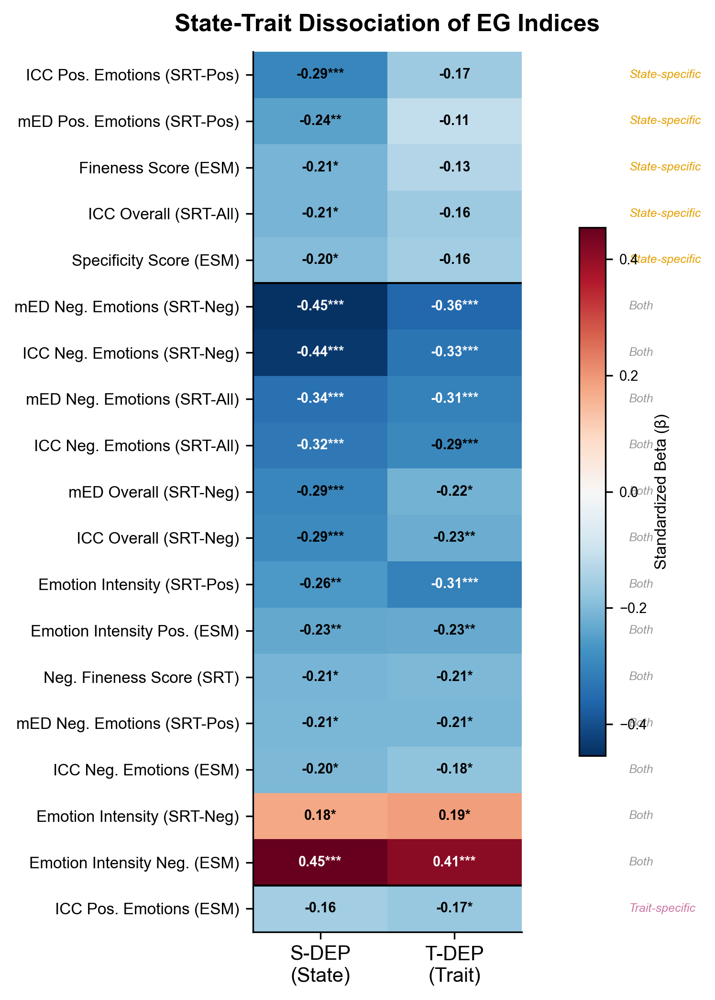
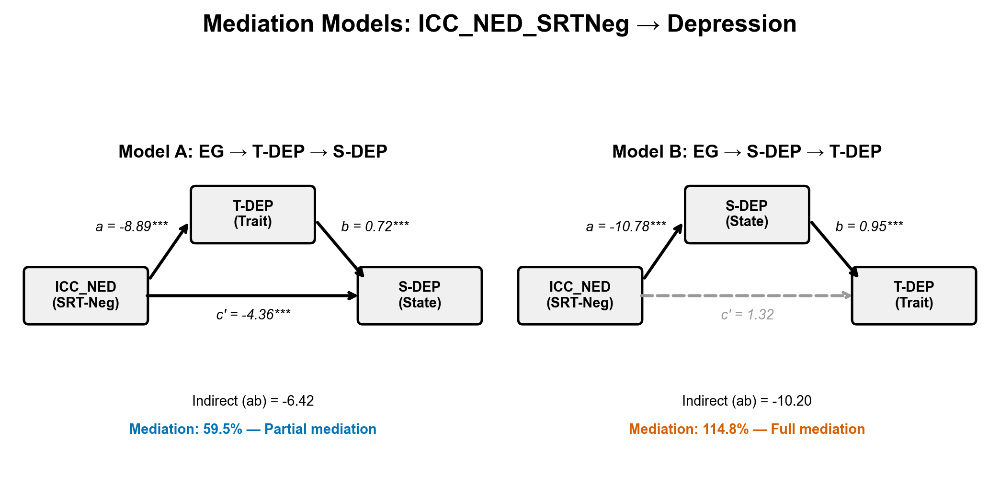
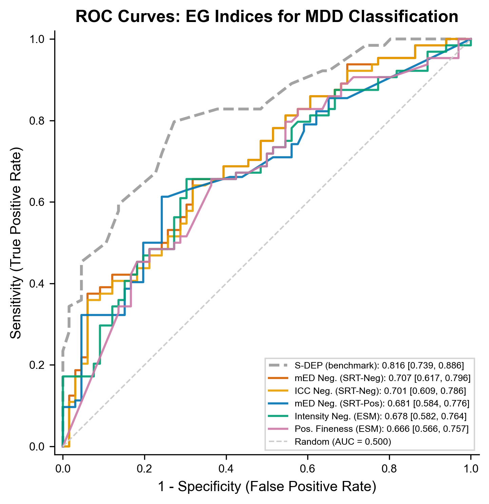

# AI 科研军团 (AI Research Army) ⚔️🔬

> 让 Claude Code 变成你的医学科研团队。10 位 AI 专家协作，从数据到投稿级论文，全程自主执行。
>
> Turn Claude Code into your medical research team. 10 AI specialists collaborate autonomously — from raw data to submission-ready manuscripts.

---

## 特点 | Features

- **医学科研专精** — 针对临床研究优化（STROBE/CONSORT 合规、数据鉴伪、P-hacking 防护）
  <br>*Medical research focused — optimized for clinical studies (STROBE/CONSORT compliance, data forensics, P-hacking prevention)*
- **10 位 AI 专家协作** — 不是一个 AI 切换角色，而是 10 位各有灵魂和专长的虚拟研究员
  <br>*10 AI specialists with distinct personas — not one AI switching hats, but 10 virtual researchers with unique expertise and thinking patterns*
- **全程自主执行** — 一句话启动，自动跑完 11 个阶段，断点可续
  <br>*Fully autonomous — one prompt triggers 11 pipeline stages; resume from breakpoints if interrupted*
- **质量闭环** — 8 层审查 + 最多 3 轮自动迭代，直到达标
  <br>*Quality loop — 8-layer review + up to 3 auto-iteration rounds until the manuscript passes*
- **不挑模型** — Claude Opus/Sonnet/Haiku 都能跑，只是质量不同
  <br>*Model-agnostic — runs on Opus/Sonnet/Haiku; better model = better output, but all work*
- **纯 Markdown** — 零依赖，零锁定，每个 skill 就是一个 `SKILL.md`
  <br>*Pure Markdown — zero dependencies, zero lock-in; every skill is just a `SKILL.md` file*

---

## 真实效果 | Real Output

以下图表由 AI 科研军团从一份 **130 人 × 265 变量** 的临床数据集自主生成，全程无人工干预。

*The following figures were autonomously generated from a **130-participant × 265-variable** clinical dataset, with zero human intervention.*

### 组间效应量森林图 | Forest Plot of Group Differences

17 个情绪粒度指标的 MDD vs HC 差异，按效应量排序，FDR 校正后显著。

*17 emotional granularity indices showing MDD vs HC differences, sorted by effect size, FDR-corrected.*


### 状态-特质分离热图 | State-Trait Dissociation Heatmap

哪些情绪粒度维度预测状态抑郁 vs 特质抑郁，分离模式一目了然。

*Which EG dimensions predict state depression (S-DEP) vs trait depression (T-DEP) — dissociation pattern at a glance.*



### 中介路径分析 | Mediation Path Analysis

EG → 状态抑郁 → 特质抑郁（完全中介）vs EG → 特质抑郁 → 状态抑郁（部分中介），不对称模式揭示作用方向。

*Asymmetric mediation: EG → S-DEP → T-DEP (full mediation) vs EG → T-DEP → S-DEP (partial), revealing directional mechanisms.*



### ROC 诊断效能曲线 | ROC Curves

情绪粒度指标对 MDD 的分类能力（AUC 0.67-0.71），含临床量表基准对比。

*EG indices for MDD classification (AUC 0.67-0.71), with clinical scale benchmarks.*



### 完整交付物 | Full Deliverables

一次 `/start-army` 全流程运行产出 | *Output from a single `/start-army` run:*

| 交付物 Deliverable | 说明 Description |
|--------|------|
| `requirement_v1.md` | 结构化需求确认书 *Structured requirement specification* |
| `forensics_report.md` | 数据鉴伪报告 GREEN/YELLOW/RED *Data forensics report with quality gate* |
| `data_dictionary.md` | 265 变量完整字典 *Complete dictionary for 265 variables* |
| `data_profile_report.md` | 数据画像（分布、缺失、异常值）*Data profile (distributions, missing patterns, outliers)* |
| `research_plan.md` | 研究设计 + 假设 + 统计方案 *Research design + hypotheses + statistical plan* |
| `analysis_results.md` | 5 项分析完整结果 *Complete results from 5 analyses* |
| `results/*.csv` | 7 张统计结果表 *7 reproducible statistical result tables* |
| `figures/*.png/.tiff` | 6 张出版级图表 300 DPI *6 publication-grade figures at 300 DPI* |
| `verified_ref_pool.md` | 文献池（含验证状态）*Reference pool with verification status* |
| `manuscript.md` | ~6000 词 IMRAD 投稿级初稿 *~6000-word IMRAD submission-ready draft* |
| `quality_report.md` | 8 层审查报告（含迭代记录）*8-layer review report with iteration log* |
| `REVIEW_STATE.json` | 审查状态（支持断点恢复）*Review state for resume capability* |

> 从 Excel 原始数据到投稿级论文的**全自动**产出，质量审查经 2 轮迭代从 67 分（C 级）提升至 79 分（B 级）通过。
>
> *Fully automated from raw Excel to submission-ready manuscript. Quality review improved from 67 (Grade C) to 79 (Grade B) through 2 auto-iteration rounds.*

---

## 快速开始 | Quick Start

### 1. 克隆仓库 | Clone

```bash
git clone https://github.com/your-org/ai-research-army.git
cd ai-research-army
```

### 2. 安装 Skills | Install

```bash
bash install.sh
```

将所有 skill 和 agent 定义复制到 `~/.claude/skills/` 和 `~/.claude/agents/`。

*Copies all skills and agent definitions to `~/.claude/skills/` and `~/.claude/agents/`.*

### 3. 启动 | Run

```
/start-army "探究 NHANES 2017-2020 数据中久坐行为与心血管疾病风险的关联"
```

然后等着收投稿包就行了。*Then sit back and wait for your submission package.*

> **前置条件 Prerequisite**: [Claude Code](https://docs.anthropic.com/en/docs/claude-code) (`npm install -g @anthropic-ai/claude-code`)

---

## 模型推荐 | Model Recommendations

| 角色 Role | 推荐 Recommended | 最低 Minimum | 说明 Notes |
|------|---------|---------|------|
| 主力执行 Main | Claude Opus | Claude Sonnet | Opus 推理更深 *deeper reasoning* |
| 统计分析 Stats | Claude Opus | Claude Sonnet | 需要强逻辑 *needs strong logic* |
| 质量审查 Review | GPT-5.x / Codex | 同一模型 Same model | 跨模型效果更好 *cross-model review is better* |
| 文献检索 Literature | 任意 Any | 任意 Any | 依赖 WebSearch *relies on WebSearch* |
| 图表生成 Figures | 任意 Any | 任意 Any | 依赖代码执行 *relies on code execution* |

> **预算建议**: 单模型方案完全可行。预算允许的话，加一个审稿模型效果更佳。
>
> *Single-model setup works fine. Adding a review model (via Codex MCP) improves quality if budget allows.*

---

## 工作流 | Pipeline

11 阶段流水线，每阶段由对应专家 Agent 执行。

*11-stage pipeline, each stage executed by a specialized agent.*

```
/start-army "研究需求 | research request"
       |
       v
 +-----------+     +-----------+     +-----------+     +----------------+
 | 需求结晶   | --> | 数据鉴伪   | --> | 数据探查   | --> | 研究设计        |
 | Require.  |     | Forensics |     | Profiling |     | Design         |
 | (Priya)   |     | (Ming)    |     | (Ming)    |     | (Priya+Kenji)  |
 +-----------+     +-----------+     +-----------+     +----------------+
                     |GATE|                                     |
                     |RED=STOP|                                 v
                                                       +----------------+
                                                       | 统计分析        |
                                                       | Statistics     |
                                                       | (Kenji)        |
                                                       +----------------+
                                                               |
       +-------------------------------------------------------+
       v
 +-----------+     +-----------+     +-----------+     +----------------+
 | 学术图表   | --> | 文献调研   | --> | 论文撰写   | --> | 引用验证        |
 | Figures   |     | Lit.Search|     | Drafting  |     | Ref.Verify     |
 | (Lena)    |     | (Jing)    |     | (Hao)     |     | (Jing)         |
 +-----------+     +-----------+     +-----------+     +----------------+
                                                               |
                                                               v
                                                       +----------------+
                                                       | 质量审查        |
                                                       | Quality Review |
                                                       | (Alex, 3 rds) |
                                                       +----------------+
                                                               |
                                                               v
                                                       +----------------+
                                                       | 投稿包组装      |
                                                       | Submission Pkg |
                                                       +----------------+
                                                               |
                                                               v
                                                          [ 交付 Done ]
```

**三个门控节点 | Three Gates**:
- **数据鉴伪 Data Forensics**: RED = 终止项目 *terminate*; YELLOW = 需人工确认 *requires confirmation*
- **引用验证 Ref Verification**: 基础 PubMed 验证 *Basic PubMed check* (🚧 完整版多源交叉验证开发中 *full multi-source cross-validation in development*)
- **质量审查 Quality Review**: 8 层检查 *8-layer check*, 最多 3 轮 *up to 3 rounds*, 不达标不交付 *no pass = no delivery*

---

## 团队 | The Team

| 成员 Member | 角色 Role | 核心能力 Core Capability |
|------|------|---------|
| **Wei** | 团队领航者 *Coordinator* | 项目编排、风险直觉、成本控制 *orchestration, risk sensing, cost control* |
| **Priya** | 需求翻译官 *Requirement Analyst* | 需求结晶、研究设计、叙事线播种 *crystallization, design, narrative seeding* |
| **Ming** | 数据工程师 *Data Engineer* | 数据鉴伪（7项）、清洗、变量标准化 *forensics (7 tests), cleaning, standardization* |
| **Kenji** | 生物统计师 *Biostatistician* | 假设检验、效应量解读、P-hacking 防护 *hypothesis testing, effect sizes, P-hacking prevention* |
| **Hao** | 学术写手 *Academic Writer* | IMRAD 撰写、叙事弧、读者心智建模 *IMRAD drafting, narrative arc, reader modeling* |
| **Lena** | 可视化设计师 *Visualization Designer* | 出版级图表、数据对账、色盲友好 *pub-grade figures, data reconciliation, colorblind-safe* |
| **Alex** | 审查官 *Quality Reviewer* | 8 层审查、数字溯源、学术诚信一票否决 *8-layer review, number tracing, integrity veto* |
| **Jing** | 文献研究员 *Literature Researcher* | PICOS 检索、PRISMA 合规、引用验证 *PICOS search, PRISMA, citation verification* |
| **Sarah** | 内容获客官 *Content Marketer* | 痛点内容、渠道运营、转化漏斗 *pain-point content, channel ops, conversion funnel* |
| **Tom** | 运营经理 *Operations Manager* | 定价策略、单位经济学、漏斗管理 *pricing, unit economics, funnel management* |

> Wei 是总指挥，不写具体内容。Sarah 和 Tom 负责商业侧，不参与科研流水线。
>
> *Wei orchestrates but doesn't write. Sarah and Tom handle business — they don't participate in the research pipeline.*

---

## 所有 Skills | All Skills

| Skill | 命令 Command | 说明 Description |
|-------|------|------|
| 全流程 Full Pipeline | `/start-army "需求"` | 一键全程 *End-to-end, one command* |
| 数据鉴伪 Forensics | `/data-forensics` | 7 项检测 + GREEN/YELLOW/RED *7 tests + quality gate* |
| 数据探查 Profiling | `/data-profiler` | 数据画像 + 字典 *Data profile + dictionary* |
| 研究设计 Design | `/research-design` | 方案 + 叙事线 + STROBE/CONSORT *Plan + narrative + reporting standard* |
| 统计分析 Statistics | `/stat-analysis` | 假设驱动 + 多路径 *Hypothesis-driven + multi-path explorer* |
| 学术图表 Figures | `/academic-figure` | 出版级 + 对账 + 色盲友好 *Pub-grade + reconciliation + colorblind-safe* |
| 文献管理 Literature | `/ref-manager` | PICOS 检索 + 引用插入 *PICOS search + citation insertion* |
| 论文撰写 Drafting | `/manuscript-draft` | IMRAD + 叙事驱动 *IMRAD + narrative-driven* |
| 引用验证 Ref Verify | `/ref-manager verify` | 基础 PubMed 验证 *Basic PubMed check* (🚧 完整版开发中 *full version in dev*) |
| 质量审查 Review | `/quality-review` | 8 层审查 + 自动迭代 *8-layer + auto-iteration (max 3 rounds)* |
| 投稿包 Submission | `/submit-package` | 期刊可上传材料 *Journal-ready upload package* |

每个 Skill 都可独立使用 | *Each skill works standalone:*

```
/data-profiler                                    # 只做数据探查 | profile only
/ref-manager "sedentary behavior cardiovascular"  # 只做文献检索 | search only
/academic-figure review                           # 只做图表审查 | figures only
```

---

## 方法论 | Methodology

> 我们开源理念，不开源具体实现——因为理念可以帮你构建自己的系统。
>
> *We open-source the philosophy, not the implementation — because principles help you build your own system.*

详见 `methodology/` 目录 | *See `methodology/` directory for details.*

### 先有故事，再有分析 | Story Before Analysis

论文的叙事脊柱应该在跑分析之前就设计好。故事是论文的灵魂——分析服务于故事，而不是反过来。

*Design the narrative spine before running analyses. The story is the soul — analyses serve the story, not the other way around.*

### 分析必须串联递进 | Serial Chain Analysis

像剥洋葱一样——每一层的答案催生下一层的问题。串联为主，并联为辅。

*Peel the onion — each layer's answer spawns the next question. Serial chains over parallel validation.*

### 标杆解剖先于写稿 | Benchmark Anatomy Before Writing

动手写之前，先解剖 3-5 篇同领域顶刊论文，提取它们的"配方"。

*Before writing, dissect 3-5 top-journal papers in your field. Extract their recipe.*

### 发现必须"可处方" | Findings Must Be Prescribable

每个核心发现都必须翻译成临床医生或政策制定者能直接用的东西。不是 "OR=0.82, p<0.001"，而是"每天少坐 3 小时，心血管风险降低 18%"。

*Every finding must translate to something a clinician or policymaker can act on. Not "OR=0.82, p<0.001" but "3 fewer hours sitting = 18% lower cardiovascular risk."*

### 质量是设计出来的，不是检查出来的 | Quality Is Designed In, Not Inspected In

8 层审查是最后的安全网，不是主要质量机制。真正的质量来自每个阶段做好自己的工作。

*The 8-layer review is the last safety net, not the primary quality mechanism. Real quality comes from every stage doing its job right.*

---

## 自定义 | Customization

### 调整 Agent | Customize Agents

修改 `agents/*.md` 即可自定义角色。 *Edit `agents/*.md` to customize any role.*

### 添加 Skill | Add Skills

在 `skills/your-skill/SKILL.md` 创建文件，运行 `bash install.sh`。

*Create `skills/your-skill/SKILL.md`, run `bash install.sh`.*

### 适配其他领域 | Adapt to Other Fields

| 组件 Component | 医学默认 Medical Default | 修改方向 Adaptation |
|------|-----------|---------|
| `agents/ming.md` | NHANES/CHARLS | 替换数据源 *Replace data sources* |
| `agents/kenji.md` | 临床统计 Clinical stats | 替换方法 *Replace methods* |
| `quality-review` | STROBE/CONSORT | 替换规范 *Replace reporting standard* |
| `ref-manager` | PubMed/CNKI | 替换文献库 *Replace databases* |
| `manuscript-draft` | 医学期刊格式 Medical journal | 替换格式 *Replace format* |

---

## 与 ARIS 的关系 | Comparison with ARIS

[ARIS](https://github.com/wanshuiyin/Auto-claude-code-research-in-sleep) 是另一个优秀的 Claude Code 科研项目，两者互补。

*ARIS is another excellent Claude Code research project. The two are complementary, not competing.*

| 维度 Dimension | ARIS | AI 科研军团 Research Army |
|------|------|-----------|
| 领域 Domain | ML/CS (arXiv, GPU) | 医学/临床 Medical/Clinical (NHANES, STROBE) |
| 核心 Core | 跨模型审稿 Cross-model review | 多 Agent 协作 + 叙事 Multi-agent + narrative |
| 实验 Experiments | GPU 部署 GPU deployment | 数据分析 Data analysis + stats |
| 质量 Quality | score >= 6/10 | 8 层审查 8-layer review + traceability |
| 产出 Output | LaTeX | Word 投稿包 Submission package |
| 依赖 Dependencies | Python + LaTeX + GPU | 纯 Markdown Zero deps |

---

## 项目结构 | Project Structure

```
ai-research-army/
  README.md                  # 本文件 | This file
  install.sh                 # 安装脚本 | Install script
  LICENSE                    # Apache-2.0

  docs/showcase/             # 效果展示 | Output showcase
    fig1_forest_plot.png
    fig2_state_trait_heatmap.png
    fig4_mediation_paths.png
    fig5_roc_curves.png

  agents/                    # 10 位 Agent | 10 agent personas
    wei.md ... tom.md

  skills/                    # 10 个 Skills | 10 Claude Code skills
    start-army/SKILL.md        # 全流程 | Full pipeline
    data-forensics/SKILL.md    # 数据鉴伪 | Data forensics
    ...

  methodology/               # 方法论 | Philosophy docs
    narrative-first.md         # 先有故事 | Story before analysis
    serial-chain.md            # 串联递进 | Serial chain
    benchmark-anatomy.md       # 标杆解剖 | Benchmark anatomy
    quality-philosophy.md      # 质量哲学 | Quality philosophy
    actionable-findings.md     # 可处方发现 | Prescribable findings

  templates/                 # 项目模板 | Project templates
    requirement.md             # 需求确认书 | Requirement spec
    narrative-thread.md        # 叙事线 | Narrative thread
    progress.md                # 进度 | Progress tracker
    state.yaml                 # 状态 | State file
```

---

## FAQ

### 可以直接运行吗？| Does it run out of the box?

是的。`bash install.sh` 后，`/start-army "你的需求"` 即可启动。Agent 角色为简化版，可根据需求深度定制。

*Yes. After `bash install.sh`, run `/start-army "your request"`. Agent personas are simplified — customize as needed.*

### 需要什么基础？| Prerequisites?

命令行 + Claude Code + 基本科研知识（p 值、置信区间）。

*Command line + Claude Code + basic research literacy (p-values, confidence intervals).*

### 一篇论文多少钱？| Cost per paper?

200K-500K tokens，Opus 全程约 $3-$8。

*200K-500K tokens. ~$3-$8 with Opus end-to-end.*

### 非医学能用吗？| Works for non-medical fields?

能，但需要改 Agent 和检查清单。详见"自定义"。

*Yes, but you'll need to adapt agents and checklists. See "Customization."*

---

## 致谢 | Acknowledgments

- [ARIS](https://github.com/wanshuiyin/Auto-claude-code-research-in-sleep) — 启发了 Skills 架构 *Inspired the skills architecture*
- [Claude Code](https://docs.anthropic.com/en/docs/claude-code) — 底层引擎 *Execution engine*
- [NHANES](https://www.cdc.gov/nchs/nhanes/index.htm) — 常用数据源 *Commonly used data source*

---

## 贡献 | Contributing

欢迎 PR！特别欢迎 | *PRs welcome! Especially:*

- 新领域 Agent 定义 *Agent definitions for new domains* (社会学 sociology, 经济学 economics, 心理学 psychology)
- 新质量检查清单 *New quality checklists*
- 方法论补充 *Methodology additions*
- Bug 修复 *Bug fixes*

---

## License

[Apache-2.0](LICENSE)

Copyright 2026 AI Research Army Contributors
